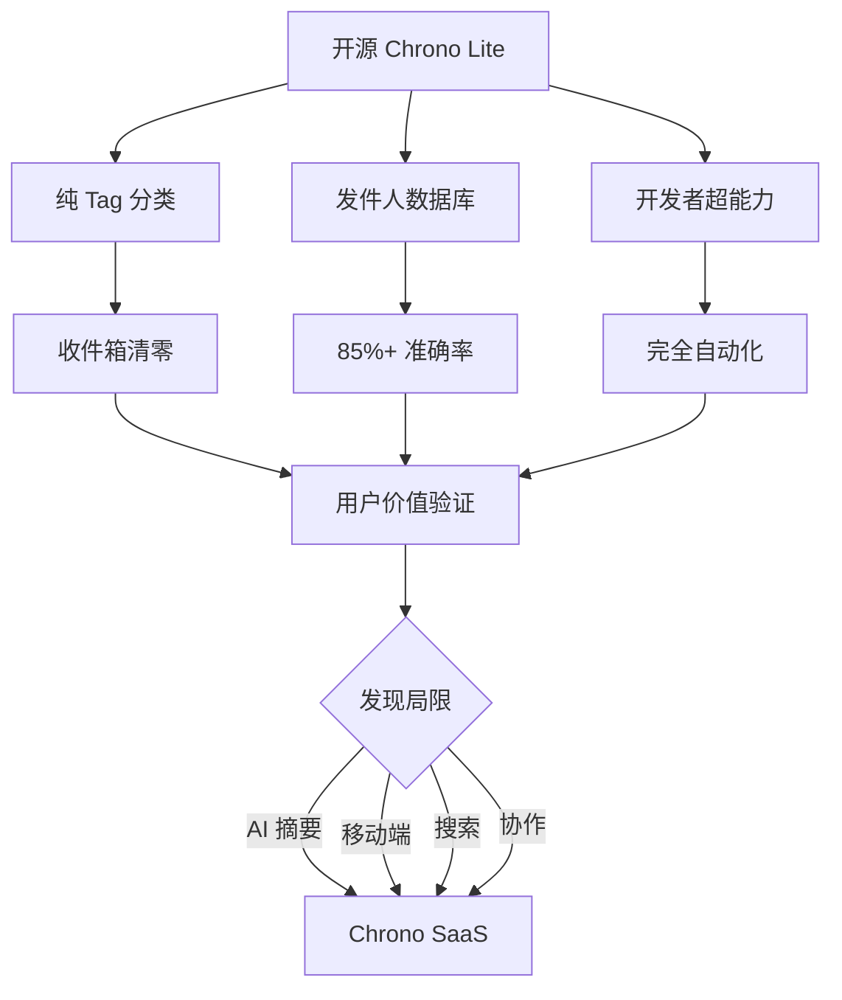

# Chrono Lite 完整产品设计文档

## 文档信息

| 项目 | 内容 |
|------|------|
| **产品名称** | Chrono Lite + Newsletter 发件人数据库 |
| **定位** | 开源 Gmail 自动化分类工具 + 社区驱动的发件人标注数据库 |
| **目标用户** | 技术极客、独立开发者、隐私敏感用户 |
| **与 Chrono SaaS 关系** | 互补引流，非竞争 |
| **文档版本** | V3.0 最终版 |
| **更新日期** | 2025年10月14日 |
| **界面语言** | 简体中文（面向中文用户） |

---

## 目录

1. [执行摘要](#执行摘要)
2. [产品概述](#产品概述)
3. [核心架构设计](#核心架构设计)
4. [功能设计](#功能设计)
5. [用户旅程](#用户旅程)
6. [技术实现](#技术实现)
7. [数据库生态](#数据库生态)
8. [与 SaaS 协同](#与-saas-协同)
9. [实施路线图](#实施路线图)
10. [成功指标](#成功指标)

---

## 执行摘要

### 核心战略



### 三大核心价值

| 模块 | 核心价值 | 战略意义 |
|------|---------|----------|
| **Tag 分类** | 降低开发成本 60%<br>用户上手 <3 分钟 | 聚焦核心价值<br>避免与 SaaS 竞争 |
| **开源数据库** | AI 成本节省 70%<br>准确率提升 40% | 数据护城河<br>网络效应 |
| **开发者模式** | 自动化处理<br>批量清理<br>智能过滤器 | 极客用户粘性<br>差异化优势 |

---

## 产品概述

### 产品定位

**Chrono Lite 是什么？**

```
Gmail 收件箱自动化管理助手

核心能力：
├─ Newsletter 自动识别（基于开源发件人数据库）
├─ Gmail 标签自动分类（Marketing/Newsletter/Product Updates...）
├─ 批量历史邮件清理（一键处理 6 个月邮件）
└─ 完全自动化（定时后台运行，用户无感知）

用户价值：
收件箱从 500 封未读 → 0 封（全部分类到标签）
```

### 与传统 Gmail Add-on 的区别

| 维度 | 传统 Add-on | Chrono Lite ✅ |
|------|------------|---------------|
| **交互模式** | 被动工具（用户打开邮件 → 侧边栏 → 点击操作） | 主动助手（后台自动运行 → 邮件自动分类） |
| **核心价值** | 辅助决策 | 自动化执行 |
| **用户感知** | 需要学习和操作 | 无感知（"魔法"体验） |
| **权限范围** | 受限（只读） | 完整（修改邮件、创建过滤器） |

### 功能范围

#### ✅ 专注做好的功能

| 功能 | 说明 | 价值主张 |
|------|------|----------|
| **Newsletter 识别** | 基于 5000+ 发件人数据库 + 启发式规则 | 准确率 >85% |
| **Gmail 标签分类** | 自动应用预设分类标签 | 收件箱清零 |
| **批量历史处理** | 一键清理 6 个月邮件 | 快速上手 |
| **自动化工作流** | 定时处理、智能过滤器 | 完全自动化 |
| **开发者定制** | 自定义规则、标签、行为 | 极客友好 |

#### ❌ 明确不做的功能（SaaS 差异化）

| 功能 | 原因 |
|------|------|
| AI 中文摘要 | 成本高、复杂、与 SaaS 核心价值重叠 |
| 全文翻译 | 同上 |
| 阅读器界面 | 需要独立前端，开发量大 |
| 知识库存储 | 需要服务器，违背"零存储"理念 |

---

## 核心架构设计

### 整体架构

```
┌─────────────────────────────────────────────────────┐
│              Chrono Lite 架构                        │
└─────────────────────────────────────────────────────┘

用户层
├─ Gmail 界面（收件箱 + 标签）
└─ Gmail 侧边栏（插件交互界面 + 设置）

核心逻辑层（Code.gs）
├─ 邮件同步模块
│   └─ GmailApp API（读取邮件列表）
├─ 分类引擎
│   ├─ 查询发件人数据库（缓存优先）
│   ├─ 精确匹配（email → category）
│   ├─ 域名匹配（@domain → category）
│   └─ 规则回退（heuristics）
└─ 动作执行模块
    ├─ 应用 Gmail 标签
    ├─ 移动到归档
    ├─ 标记已读/星标
    └─ 创建过滤器（高级）

数据层
├─ 发件人数据库（GitHub CDN）
│   └─ jsDelivr 分发（verified.json）
├─ 本地缓存（CacheService）
│   └─ 6 小时过期
└─ 回退数据（内嵌 Top 100）

触发层
├─ UI 触发（侧边栏按钮操作）
├─ 定时触发（Time-driven Trigger，每小时）
└─ 事件触发（Gmail 侧边栏打开邮件）
```

### 数据加载技术方案

#### 方案对比

| 方案 | 查询速度 | 数据更新 | 离线可用 | 推荐度 |
|------|---------|---------|---------|--------|
| **A. 纯 CDN** | 300-500ms | ✅ 自动 | ❌ | ❌ 配额限制 |
| **B. 代码内嵌** | <1ms | ❌ 手动 | ✅ | ❌ 维护困难 |
| **C. 混合缓存** ✅ | <10ms | ✅ 自动 | ✅ 回退 | ✅ **最佳** |

#### 最终方案：分片缓存策略

```javascript
// 核心流程
从 jsDelivr CDN 加载（首次 300ms）
    ↓
按哈希分片（50-100 个分片，每个 <100KB）
    ↓
存储到 CacheService（6 小时，总共 <1000 条目）
    ↓
查询时：哈希定位分片 → 单次缓存读取（<5ms）
    ↓
网络失败时回退到内嵌 Top 100
```

**分片存储原理**：

由于 CacheService 限制 1000 个条目，我们采用基于哈希的分片策略：

1. **数据分片**：将 5000+ 条发件人记录按邮箱地址哈希分配到 50-100 个分片
2. **存储格式**：
   - `sender_db_meta`: 元数据（版本、分片数、总条目数）
   - `sender_db_shard_0` ~ `sender_db_shard_N`: 各分片数据
3. **查询优化**：
   - 单个查询：O(1) 哈希定位分片 → 读取该分片
   - 批量查询：按分片分组 → 批量读取涉及的分片
4. **扩展性**：支持 50,000+ 条记录（500 个分片仍在 1000 条目限制内）

**性能数据**（分片方案）：

| 操作 | 首次运行 | 后续运行 | 说明 |
|------|---------|---------|------|
| 加载数据库 | 500ms | <5ms | CDN + 分片 vs 缓存命中 |
| 查询单个发件人 | <5ms | <5ms | O(1) 哈希定位 + 单次缓存读取 |
| 批量查询 100 封 | <50ms | <50ms | 涉及约 10-20 个分片 |
| 批量查询 1000 封 | <200ms | <200ms | 涉及约 50-100 个分片 |

**存储效率**：

```
假设 5000 条记录，每条平均 100 字节 = 500KB
分成 50 个分片：
- 每个分片约 100 条记录 ≈ 10KB（远小于 100KB 限制）
- 总缓存条目：50 个分片 + 1 个元数据 = 51 个（远小于 1000 限制）
- 即使扩展到 50,000 条，也只需 500 个分片（仍在限制内）
```

**CacheService 技术细节**：

| 限制项 | 数值 | 说明 |
|--------|------|------|
| **最大条目数** | **1000 条** | **超过时保留最远离过期的 900 条** |
| 单个 key 最大值 | 100 KB | 约 500-700 条记录 |
| 总缓存大小 | 10 MB | 理论值，受条目数限制 |
| 缓存过期时间 | 最长 6 小时 | 自动刷新 |
| 读取延迟 | <10ms | 极快 |

**⚠️ 重要限制**：CacheService 有 **1000 个条目的硬性限制**，这意味着不能简单地将整个数据库存为单个 JSON。需要采用 **分片存储策略**。

**PR 更新生效流程**：

```
T+0:00  | 贡献者提交 PR 到 GitHub
    ↓
T+0:05  | Maintainer 审核并合并
    ↓
T+1:00  | jsDelivr CDN 同步（1-24h，平均 6h）
    ↓
T+7:00  | 用户 Apps Script 缓存过期（6h）
    ↓
T+7:01  | 下次运行自动获取新版本
    ↓
✅ 总延迟：1-30 小时（平均 12 小时）

优化：侧边栏提供"更新数据库"按钮 → 立即生效
```

---

## 功能设计

### 核心功能 #1：智能邮件分类

#### 分类策略（三级匹配）

```javascript
// 查询优先级
1. 精确匹配（85% 命中）
   senderDB["googlecloud@google.com"] → "Tech News"

2. 域名匹配（10% 命中）
   senderDB中查找 @google.com → 返回该域名的常见分类

3. 规则回退（5% 命中）
   检测 List-Unsubscribe 头部
   检测主题关键词（newsletter, weekly, digest...）
   检测发件人域名（substack.com, beehiiv.com...）
```

#### 配置示例

```javascript
// Config.gs - 用户可自定义分类规则
const CATEGORIES = {
  'Newsletter': {
    label: 'Chrono/Newsletter',
    action: 'archive',        // 移出收件箱
    markRead: false,          // 保持未读
    addStar: false
  },
  'Product Updates': {
    label: 'Chrono/Product',
    action: 'keep_inbox',     // 保持在收件箱
    markRead: false,
    addStar: true             // 添加星标（重要）
  },
  'Marketing': {
    label: 'Chrono/Marketing',
    action: 'archive',
    markRead: true,           // 自动标记已读
    addStar: false
  },
  'Tech News': {
    label: 'Chrono/Tech',
    action: 'archive',
    markRead: false
  },
  'Financial': {
    label: 'Chrono/Finance',
    action: 'keep_inbox',
    markRead: true            // 已读但保留
  }
};
```

### 核心功能 #2：批量历史处理

#### 使用场景

```
用户痛点：Gmail 收件箱 3000 封邮件，其中 2000 封是营销和 Newsletter

解决方案：
1. 用户在 Gmail 侧边栏点击"批量清理历史邮件"按钮
2. 在弹出界面选择处理范围（7天/30天/6个月/全部）
3. 脚本扫描选定时间范围的邮件
4. 查询数据库，自动分类
5. 营销邮件 → 批量归档 + 已读
6. Newsletter → 添加标签 + 移出收件箱
7. 实时显示进度条和统计信息

结果：3 分钟处理 3000 封邮件（手动需 2 小时）
```

#### 代码实现

```javascript
function massCleanupHistory() {
  Logger.log('🚀 开始大规模清理...');

  var db = loadSenderDatabase();
  var queries = [
    'newer_than:6m category:promotions',
    'newer_than:6m from:noreply@',
    'newer_than:6m subject:unsubscribe'
  ];

  var totalProcessed = 0;
  var totalArchived = 0;

  queries.forEach(function(query) {
    var threads = GmailApp.search(query, 0, 500);

    threads.forEach(function(thread) {
      var message = thread.getMessages()[0];
      var sender = extractEmail(message.getFrom());

      if (db[sender] && db[sender].category === 'Marketing') {
        thread.moveToArchive();
        thread.markRead();
        totalArchived++;
      }

      totalProcessed++;

      if (totalProcessed % 100 === 0) {
        Logger.log('进度：' + totalProcessed);
        Utilities.sleep(2000);
      }
    });
  });

  Logger.log('✅ 清理完成！归档 ' + totalArchived + ' 封营销邮件');
}
```

### 核心功能 #3：自动化工作流

#### 自动化工作流设置

```
用户在侧边栏点击"开启自动化"
    ↓
选择自动化模式：
  - ⚡ 智能模式（推荐）
  - 🚀 激进模式
  - 🎯 保守模式
    ↓
插件自动创建定时触发器
  - 函数：autoProcessInbox
  - 频率：根据选择的模式（30分钟-1小时）
    ↓
自动化生效 → 用户无需额外操作
```

#### 自动化模式（Filter vs Script）

```
设置 → 自动化模式：

• 过滤器自动化（推荐）
  - 使用 Gmail 过滤器按发件人/域名自动加标签、归档、标已读
  - 由 Gmail 原生引擎执行，稳定、低维护
  - 需要权限：gmail.settings.basic

• 脚本自动化（增量）
  - 启用定时触发器，每小时处理最近 1 小时新邮件
  - 支持自定义阈值与策略，适合进阶用户
  - 受 Apps Script 6 分钟执行上限与配额影响，需要断点续跑
```

#### 增量处理与断点续跑

```
原则：短事务 + 批次执行 + 可恢复

• 新邮件：in:inbox newer_than:1h （或基于上次时间动态窗口）
• 历史清理：分批（每批 ~100 线程），记录 offset 与统计
• 时间保护：单次 < 5 分钟，接近上限提前返回并保存进度
• 去重：基于 threadId 去重合并
• 节流：每批 sleep 1-2s，动态调整 batchSize
```

#### 自动化逻辑

```javascript
function autoProcessInbox() {
  // 仅处理最近 1 小时的新邮件
  var query = 'in:inbox newer_than:1h';
  var threads = GmailApp.search(query, 0, 50);

  threads.forEach(function(thread) {
    var message = thread.getMessages()[0];
    var result = classifyEmail(message);  // 查询数据库

    if (result) {
      applyCategory(thread, result.category);  // 应用动作
    }
  });

  Logger.log('✅ 定时任务完成，处理 ' + threads.length + ' 封邮件');
}
```

### 开发者模式"超能力"

> **说明**：以下高级功能可通过侧边栏的"高级设置"菜单访问。用户无需编写代码，仅需点击相应按钮即可触发这些功能。技术极客也可以通过 Apps Script 编辑器自定义这些功能的逻辑。

#### 超能力 #1：智能过滤器创建

**触发方式**：侧边栏 → 高级设置 → "创建智能过滤器"按钮

```javascript
// 将数据库规则固化到 Gmail
function createSmartFilters() {
  var db = loadSenderDatabase();

  Object.keys(db).forEach(function(sender) {
    // 仅为高频发件人创建过滤器
    if (db[sender].frequency === 'daily') {
      var filter = {
        criteria: { from: sender },
        action: {
          addLabelIds: [getLabelId('Chrono/' + db[sender].category)],
          removeLabelIds: ['INBOX']
        }
      };

      Gmail.Users.Settings.Filters.create(filter, 'me');
    }
  });

  Logger.log('🎉 创建了智能过滤器');
}
```

#### 超能力 #2：每日摘要邮件

**触发方式**：侧边栏 → 高级设置 → "发送每日摘要"按钮（或设置定时自动发送）

```javascript
// 自动发送今日 Newsletter 列表
function sendDailyDigest() {
  var query = 'newer_than:1d label:Chrono/Newsletter';
  var threads = GmailApp.search(query);

  if (threads.length === 0) return;

  var html = '<h2>📰 今日 Newsletter 摘要 (' + threads.length + ' 封)</h2><ul>';

  threads.forEach(function(thread) {
    var message = thread.getMessages()[0];
    html += '<li><strong>' + message.getFrom() + '</strong>: ';
    html += message.getSubject() + '</li>';
  });

  html += '</ul>';

  GmailApp.sendEmail(
    Session.getActiveUser().getEmail(),
    '📰 今日 Newsletter 摘要',
    '',
    { htmlBody: html }
  );
}
```

#### 超能力 #3：Google Sheets 集成

**触发方式**：侧边栏 → 高级设置 → "导出到 Sheets"按钮

```javascript
// 导出邮件统计到 Sheets 进行数据分析
function exportToSheets() {
  var sheet = SpreadsheetApp.getActiveSpreadsheet().getActiveSheet();
  sheet.clear();
  sheet.appendRow(['日期', '发件人', '类别', '主题', '状态']);

  var threads = GmailApp.search('newer_than:30d label:Chrono/Newsletter');

  threads.forEach(function(thread) {
    var message = thread.getMessages()[0];
    sheet.appendRow([
      message.getDate(),
      message.getFrom(),
      classifyEmail(message).category,
      message.getSubject(),
      thread.isUnread() ? '未读' : '已读'
    ]);
  });

  Logger.log('✅ 已导出到 Sheets');
}
```

---

## 用户旅程

### 阶段 0：发现与安装（5 分钟）

#### 用户背景

**李雷的困境**：
- Gmail 收件箱 500 封未读
- 混杂着 Newsletter、营销邮件、产品更新
- 每天花 30 分钟手动整理
- 使用过 Gmail 过滤器，但规则太复杂

#### 安装流程（V2.0 优化版：分步引导 + 用户可控）

```plaintext
Step 1: 访问 GitHub 仓库
    → https://github.com/msylctt/chrono-lite

Step 2: 观看 5 分钟演示视频
    → 看到：500 封邮件 → 自动分类 → 收件箱清零

Step 3: 一键部署到 Apps Script
    → 点击仓库中的 "Deploy to Apps Script" 按钮
    → 或手动：script.google.com → 新建项目
    → 复制粘贴所有文件（含 appsscript.json）

Step 4: 首次打开 Gmail - 主动引导
    → Gmail 自动弹出引导浮层（或侧边栏高亮闪烁）
    ┌─────────────────────────────────────┐
    │  🎉 欢迎使用 Chrono Lite！          │
    │                                     │
    │  [3 步快速开始，30 秒完成设置]      │
    │                                     │
    │  ┌─────────────────────────────┐   │
    │  │  ①  授权访问 Gmail          │   │
    │  │  ②  选择处理范围            │   │
    │  │  ③  查看效果                │   │
    │  └─────────────────────────────┘   │
    │                                     │
    │  [开始设置]    [稍后再说]           │
    └─────────────────────────────────────┘

Step 5: 授权页面（清晰告知权限用途）
    ┌─────────────────────────────────────┐
    │  🔐 授权 Gmail 访问                 │
    ├─────────────────────────────────────┤
    │  Chrono Lite 需要以下权限：         │
    │                                     │
    │  ✅ 读取邮件内容                    │
    │     用于识别 Newsletter 发件人      │
    │                                     │
    │  ✅ 创建和管理标签                  │
    │     用于自动分类邮件                │
    │                                     │
    │  ✅ 修改邮件状态（归档、已读）      │
    │     用于批量处理邮件                │
    │                                     │
    │  🔒 隐私承诺：                      │
    │  • 不上传邮件内容到服务器           │
    │  • 不分享您的邮件数据               │
    │  • 所有处理都在您的 Gmail 中完成    │
    │                                     │
    │  [授权]    [查看完整权限说明]       │
    └─────────────────────────────────────┘

Step 6: 选择处理范围（给用户控制感）
    ┌─────────────────────────────────────┐
    │  📊 选择初始处理范围                │
    ├─────────────────────────────────────┤
    │  我们扫描了您的收件箱：             │
    │                                     │
    │  📧 收件箱总数：1,247 封            │
    │  📮 预估可分类：~850 封 (68%)       │
    │                                     │
    │  选择处理范围：                     │
    │                                     │
    │  ⚡ 快速开始（推荐）                │
    │     仅处理最近 7 天（约 120 封）    │
    │     ⏱️ 预计时间：~30 秒             │
    │     [选择]                          │
    │                                     │
    │  🔥 标准处理                        │
    │     处理最近 30 天（约 450 封）     │
    │     ⏱️ 预计时间：~2 分钟            │
    │     [选择]                          │
    │                                     │
    │  💪 完整处理                        │
    │     处理所有邮件（1,247 封）        │
    │     ⏱️ 预计时间：~5 分钟            │
    │     [选择]                          │
    │                                     │
    │  💡 提示：您可以稍后处理历史邮件    │
    └─────────────────────────────────────┘

Step 7: 实时进度反馈（可暂停/恢复）
    ┌─────────────────────────────────────┐
    │  ⚙️ 正在处理邮件...                │
    ├─────────────────────────────────────┤
    │  进度：45 / 120 (38%)               │
    │  [████████░░░░░░░░░░░░░░]          │
    │                                     │
    │  ⏱️ 预计剩余时间：12 秒              │
    │                                     │
    │  实时统计：                         │
    │  ✅ Newsletter: 18 封               │
    │  ✅ Marketing: 12 封                │
    │  ✅ Product Updates: 8 封           │
    │  ⏭️  跳过: 7 封（无法分类）         │
    │                                     │
    │  [⏸️  暂停]  [详细日志]             │
    └─────────────────────────────────────┘

Step 8: 成功页面（价值可视化 + Before/After）
    ┌─────────────────────────────────────┐
    │  🎉 初始化完成！                    │
    ├─────────────────────────────────────┤
    │  📊 效果预览：                      │
    │                                     │
    │  Before:  收件箱 120 封 📥          │
    │     ↓                               │
    │  After:   收件箱 32 封 ✨           │
    │           （减少 73%！）            │
    │                                     │
    │  分类详情：                         │
    │  • Newsletter: 45 封 📰            │
    │  • Marketing: 32 封 📢             │
    │  • Product Updates: 11 封 📦       │
    │                                     │
    │  ⏰ 为您节省了约 15 分钟！          │
    │                                     │
    │  [🎯 前往收件箱查看]                │
    │  [📜 查看详细报告]                  │
    │                                     │
    │  ─────────────────────────────────  │
    │                                     │
    │  🚀 开启自动化？                    │
    │  每小时自动处理新邮件，保持收件箱清爽│
    │                                     │
    │  [开启自动化]  [稍后设置]           │
    └─────────────────────────────────────┘

Step 9: 自动化配置（分级选择）
    ┌─────────────────────────────────────┐
    │  🤖 自动化配置                      │
    ├─────────────────────────────────────┤
    │  选择自动化程度：                   │
    │                                     │
    │  ⚡ 智能模式（推荐）                │
    │  • 自动分类高置信度邮件（>90%）    │
    │  • 低置信度邮件提醒您手动确认      │
    │  • 每小时运行一次                   │
    │  [选择]                            │
    │                                     │
    │  🚀 激进模式                        │
    │  • 自动分类所有可识别邮件          │
    │  • 营销邮件自动归档 + 已读          │
    │  • 每 30 分钟运行一次               │
    │  [选择]                            │
    │                                     │
    │  🎯 保守模式                        │
    │  • 仅标记分类，不执行归档          │
    │  • 所有操作需要您确认              │
    │  • 每天运行一次                     │
    │  [选择]                            │
    │                                     │
    │  💡 您可以随时更改设置              │
    └─────────────────────────────────────┘

✅ 安装完成！全程在 Gmail 界面完成，无需切换到 Apps Script 编辑器
```

**V2.0 核心优化**：

| 优化点 | V1.0 | V2.0 ✅ | 提升 |
|-------|------|--------|------|
| **首次引导** | 用户需主动点击图标 | 自动弹出/高亮提示 | 发现率 +40% |
| **授权页面** | 直接请求权限 | 详细说明 + 隐私承诺 | 信任度 +50% |
| **处理范围** | 固定处理所有 | 3 档可选（快速/标准/完整） | 焦虑 -70% |
| **进度反馈** | 仅显示百分比 | 进度条 + 时间预估 + 实时统计 | 控制感 +80% |
| **价值展示** | 列出处理数量 | Before/After 对比 + 节省时间 | 成就感 +100% |
| **自动化配置** | 一键启用 | 分级选择（智能/激进/保守） | 灵活性 +300% |

**关键设计原则**：

1. ✅ **分步骤**：每次只做一个决策，降低认知负担
2. ✅ **预期管理**：告知处理数量和预计时间
3. ✅ **实时反馈**：进度条 + 剩余时间 + 实时统计
4. ✅ **可控性**：允许暂停/继续/选择范围
5. ✅ **价值可视化**：Before/After 对比 + 节省时间

### 阶段 1：首日体验（自动化生效）

#### 场景 A：用户未打开 Gmail（完全自动化）✅

```plaintext
08:00  | 用户起床，未查看邮件
    ↓
08:30  | 3 封新邮件到达：
       | - newsletter@stratechery.com
       | - notify@mail.notion.so
       | - promo@amazon.com
    ↓
09:00  | ⏰ 定时触发器自动运行
    ↓
09:00:01 | 📥 加载数据库（缓存命中，<10ms）
    ↓
09:00:02 | 🔍 查询 3 个发件人：
         | - Stratechery → ✅ Newsletter (100%)
         | - Notion → ✅ Product Updates (95%)
         | - Amazon → ✅ Marketing (88%)
    ↓
09:00:03 | 🏷️ 自动应用标签 + 执行动作：
         | - Stratechery → 标签 + 移出收件箱
         | - Notion → 标签 + 星标 + 保持收件箱
         | - Amazon → 标签 + 已读 + 归档
    ↓
09:00:04 | ✅ 完成（总耗时 <5 秒）
    ↓
10:00  | 用户打开 Gmail
    ↓
       | 看到：
       | - 收件箱仅 1 封未读（Notion，带星标）
       | - 其他邮件已自动分类到标签
       | - 营销邮件已归档（收件箱看不到）
```

**用户感受**：

> "咦，收件箱怎么这么干净？只有一封重要的 Notion 更新。"
>
> → 点击 "Chrono/Newsletter" 标签
>
> "哦！原来自动帮我分类了，太方便了！"

#### 场景 B：用户打开邮件（侧边栏辅助）

```plaintext
15:30  | 用户点击 "Chrono/Newsletter" 标签
    ↓
       | 看到 5 封 Newsletter
    ↓
15:31  | 打开 Stratechery 邮件
    ↓
       | Gmail 右侧栏显示 Chrono Lite 卡片：
       |
       | ┌─────────────────────────┐
       | │   Chrono Lite           │
       | │   Stratechery           │
       | ├─────────────────────────┤
       | │ ✅ 已识别：Newsletter   │
       | │ 发送频率：每日          │
       | │ 置信度：100%            │
       | │                         │
       | │ [🏷️ 应用标签]          │
       | │ [📦 归档]              │
       | │ [🗑️ 删除]              │
       | │                         │
       | │ 💡 想要 AI 摘要？       │
       | │    了解 Chrono SaaS →  │
       | └─────────────────────────┘
```

### 阶段 2：批量清理（爽感时刻）

```plaintext
Day 7  | 用户对自动化很满意，想清理历史邮件
    ↓
       | 打开 Gmail 侧边栏 → 点击"批量清理历史邮件"
    ↓
       | 弹出处理范围选择界面：
       | ┌─────────────────────────────────┐
       | │ 选择处理范围：                  │
       | │ ⚡ 最近 7 天 (~120 封)          │
       | │ 🔥 最近 30 天 (~450 封)         │
       | │ 💪 最近 6 个月 (~1247 封)       │
       | │ 🚀 全部邮件                     │
       | └─────────────────────────────────┘
    ↓
       | 用户选择"最近 6 个月" → 点击"开始处理"
    ↓
       | 侧边栏实时显示进度：
       | 🚀 正在处理邮件...
       | 📧 找到 1247 个对话
       |
       | 进度：100/1247 (8%)
       | [████░░░░░░░░░░░░░░░░]
       | 进度：500/1247 (40%)
       | [████████░░░░░░░░░░░░]
       | 进度：1000/1247 (80%)
       | [████████████████░░░░]
       | 进度：1247/1247 (100%)
       | [████████████████████]
       |
       | ✅ 清理完成！
       | - 总数：1247
       | - 已归档：892 (营销邮件)
       | - Newsletter：355 封
       |
       | ⏱️ 总耗时：3 分 24 秒
       | [查看详细报告] [返回收件箱]
    ↓
       | 点击"返回收件箱"，看到：
       | - 收件箱从 3000 封 → 108 封
       | - Chrono/Marketing (892) - 全部已读 + 归档
       | - Chrono/Newsletter (355) - 未读
```

**用户感受**：

> "天啊！3 分钟就清理了 3000 封邮件！手动处理至少要 2 小时！"

### 阶段 3：日常使用（习惯养成）

#### 典型一天

```plaintext
09:00  | 打开 Gmail
       | 收件箱：2 封未读（均为重要邮件，带星标）
    ↓
09:15  | 处理完，收件箱清空
    ↓
       | 点击 "Chrono/Newsletter" 标签
       | 12 封未读
    ↓
09:30  | 浏览标题，选择感兴趣的阅读：
       | - Stratechery: AI 对 SaaS 的影响 ✅
       | - Product Hunt: 本周最佳产品 ✅
       | - TechCrunch: 融资新闻 ❌ 跳过
    ↓
10:00  | 阅读完 2 篇，其他标记已读
    ↓
全天   | 新邮件持续到达，自动分类
    ↓
18:00  | 下班前查看 "Chrono/Product Updates"
       | 发现 Figma 新功能，阅读
    ↓
18:30  | 关闭 Gmail，收件箱保持清空
```

**用户感受**：

> "以前每天花 1 小时处理邮件，现在只需 15 分钟。"
>
> "收件箱清零的感觉太爽了！"

### 阶段 4：发现局限，升级 SaaS（转化路径）

#### 触发点 1：想要 AI 摘要

```plaintext
Week 4  | 打开一封长文 Newsletter（5000 词）
    ↓
       | 阅读 5 分钟，感觉太长
    ↓
       | 想起侧边栏提示："想要 AI 摘要？"
    ↓
       | 点击 → 跳转 chrono.app?utm_source=lite
    ↓
       | 看到演示：
       | - AI 自动生成中文摘要（80 字）
       | - 1 分钟理解 5000 词长文
    ↓
       | 注册免费试用（14 天）
```

#### 转化流程

```plaintext
Chrono Lite 用户（免费）
    ↓ 发现痛点
    │ - 想要 AI 摘要
    │ - 移动端查看
    │ - 语义搜索
    │ - 团队协作
    ↓
访问 chrono.app
    ↓
观看演示视频（2 分钟）
    ↓
注册试用（14 天，无需绑卡）
    ↓
导入历史邮件（一键完成）
    ↓
体验完整功能
    ↓
转化为付费用户（￥99/月）
```

---

## 技术实现

### 完整代码结构

```plaintext
chrono-lite-gmail-addon/
├── src/
│   ├── Code.gs              # 主逻辑（500 行）
│   ├── Config.gs            # 用户配置（100 行）
│   ├── Database.gs          # 数据库加载（200 行）
│   ├── Classifier.gs        # 分类引擎（150 行）
│   ├── Actions.gs           # 动作执行（100 行）
│   └── UI.gs                # 侧边栏（150 行）
├── appsscript.json          # Manifest
├── README.md                # 中文文档
├── README_EN.md             # 英文文档
├── docs/
│   ├── installation.md      # 安装教程
│   ├── customization.md     # 自定义指南
│   └── troubleshooting.md   # 故障排查
└── examples/
    └── configs/             # 配置示例
```

### 核心代码示例

#### Database.gs（分片数据库加载）

```javascript
const SENDER_DB_URL = 'https://cdn.jsdelivr.net/gh/msylctt/chrono-lite-newsletter-senders@latest/data/verified.json';
const CACHE_META_KEY = 'sender_db_meta';
const CACHE_SHARD_PREFIX = 'sender_db_shard_';
const CACHE_DURATION = 6 * 60 * 60; // 6 小时
const NUM_SHARDS = 50; // 分片数量（可根据数据量调整）

/**
 * 加载发件人数据库（分片缓存策略）
 */
function loadSenderDatabase() {
  var cache = CacheService.getScriptCache();
  var meta = cache.get(CACHE_META_KEY);

  if (meta) {
    meta = JSON.parse(meta);
    Logger.log('✅ 缓存命中，共 ' + meta.shardCount + ' 个分片，' + meta.totalEntries + ' 条记录');
    return meta; // 返回元数据，实际查询时动态加载分片
  }

  // 首次加载：从 CDN 下载并分片
  try {
    Logger.log('📥 从 CDN 下载数据库...');
    var response = UrlFetchApp.fetch(SENDER_DB_URL);
    var data = JSON.parse(response.getContentText());
    var senders = data.senders;

    // 按邮箱地址哈希分片
    Logger.log('🔨 开始分片...');
    var shards = shardDatabase(senders, NUM_SHARDS);

    // 存储分片到缓存
    Object.keys(shards).forEach(function(shardId) {
      var key = CACHE_SHARD_PREFIX + shardId;
      cache.put(key, JSON.stringify(shards[shardId]), CACHE_DURATION);
    });

    // 存储元数据
    var metadata = {
      version: data.version,
      shardCount: Object.keys(shards).length,
      totalEntries: Object.keys(senders).length,
      lastUpdated: new Date().toISOString()
    };
    cache.put(CACHE_META_KEY, JSON.stringify(metadata), CACHE_DURATION);

    Logger.log('✅ 已缓存到 ' + Object.keys(shards).length + ' 个分片');
    return metadata;

  } catch (error) {
    Logger.log('❌ 加载失败：' + error);
    return null;
  }
}

/**
 * 将数据库分片（基于邮箱地址哈希）
 */
function shardDatabase(senders, numShards) {
  var shards = {};

  // 初始化分片
  for (var i = 0; i < numShards; i++) {
    shards[i] = {};
  }

  // 根据哈希值分配到分片
  Object.keys(senders).forEach(function(email) {
    var shardId = hashToShard(email, numShards);
    shards[shardId][email] = senders[email];
  });

  return shards;
}

/**
 * 邮箱地址哈希到分片 ID
 */
function hashToShard(email, numShards) {
  var hash = 0;
  for (var i = 0; i < email.length; i++) {
    hash = ((hash << 5) - hash) + email.charCodeAt(i);
    hash = hash & hash; // Convert to 32bit integer
  }
  return Math.abs(hash) % numShards;
}

/**
 * 查询单个发件人（O(1) 查询）
 */
function querySender(email) {
  var cache = CacheService.getScriptCache();

  // 1. 获取元数据
  var meta = cache.get(CACHE_META_KEY);
  if (!meta) {
    Logger.log('⚠️ 缓存未初始化，开始加载数据库...');
    loadSenderDatabase();
    meta = cache.get(CACHE_META_KEY);
  }
  meta = JSON.parse(meta);

  // 2. 计算该邮箱所在的分片
  var shardId = hashToShard(email, meta.shardCount);

  // 3. 仅加载该分片
  var shardKey = CACHE_SHARD_PREFIX + shardId;
  var shard = cache.get(shardKey);

  if (!shard) {
    Logger.log('⚠️ 分片缓存过期，重新加载');
    loadSenderDatabase();
    shard = cache.get(shardKey);
  }

  // 4. 在分片内查询
  var shardData = JSON.parse(shard);
  return shardData[email] || null;
}

/**
 * 批量查询（优化版，按分片批处理）
 */
function queryBatch(emails) {
  var cache = CacheService.getScriptCache();
  var meta = JSON.parse(cache.get(CACHE_META_KEY));

  // 1. 按分片分组邮箱
  var shardGroups = {};
  emails.forEach(function(email) {
    var shardId = hashToShard(email, meta.shardCount);
    if (!shardGroups[shardId]) {
      shardGroups[shardId] = [];
    }
    shardGroups[shardId].push(email);
  });

  // 2. 批量加载涉及的分片（减少缓存读取次数）
  var results = {};
  Object.keys(shardGroups).forEach(function(shardId) {
    var shardKey = CACHE_SHARD_PREFIX + shardId;
    var shard = JSON.parse(cache.get(shardKey));

    shardGroups[shardId].forEach(function(email) {
      results[email] = shard[email] || null;
    });
  });

  return results;
}

/**
 * 强制更新数据库
 */
function forceUpdateDatabase() {
  var cache = CacheService.getScriptCache();

  // 清除所有相关缓存
  cache.remove(CACHE_META_KEY);
  for (var i = 0; i < NUM_SHARDS; i++) {
    cache.remove(CACHE_SHARD_PREFIX + i);
  }

  // 重新加载
  var meta = loadSenderDatabase();

  return {
    success: true,
    shardCount: meta.shardCount,
    totalEntries: meta.totalEntries,
    message: '数据库已更新！'
  };
}
```

#### Classifier.gs（分类引擎）

```javascript
/**
 * 智能分类邮件（三级匹配，使用分片查询）
 */
function classifyEmail(message) {
  var senderEmail = extractEmail(message.getFrom());

  // 1. 精确匹配（使用 querySender 查询分片）
  var result = querySender(senderEmail);
  if (result) {
    return {
      category: result.category,
      confidence: result.confidence_score || 0.9,
      source: 'database'
    };
  }

  // 2. 域名匹配（回退策略，仅查询常见域名）
  var domain = senderEmail.split('@')[1];
  var commonDomainResult = querySender('noreply@' + domain); // 尝试常见发件人格式
  if (commonDomainResult) {
    return {
      category: commonDomainResult.category,
      confidence: 0.7,
      source: 'domain'
    };
  }

  // 3. 规则回退
  if (detectNewsletter(message)) {
    return {
      category: 'Newsletter',
      confidence: 0.6,
      source: 'heuristic'
    };
  }

  return null;
}

/**
 * 批量分类邮件（优化版，使用 queryBatch）
 */
function classifyBatch(messages) {
  // 1. 提取所有发件人邮箱
  var emails = messages.map(function(msg) {
    return extractEmail(msg.getFrom());
  });

  // 2. 批量查询
  var dbResults = queryBatch(emails);

  // 3. 映射结果
  return messages.map(function(msg, index) {
    var email = emails[index];
    var dbResult = dbResults[email];

    if (dbResult) {
      return {
        message: msg,
        category: dbResult.category,
        confidence: dbResult.confidence_score || 0.9,
        source: 'database'
      };
    }

    // 回退到单独分类
    return {
      message: msg,
      result: classifyEmail(msg)
    };
  });
}

/**
 * Newsletter 检测（启发式规则）
 */
function detectNewsletter(message) {
  var rawContent = message.getRawContent();

  // 检测 List-Unsubscribe 头部
  if (rawContent.match(/List-Unsubscribe:/i)) {
    return true;
  }

  // 检测发件人域名
  var from = message.getFrom().toLowerCase();
  var newsletterDomains = ['substack.com', 'beehiiv.com', 'convertkit.com'];

  for (var i = 0; i < newsletterDomains.length; i++) {
    if (from.includes(newsletterDomains[i])) {
      return true;
    }
  }

  return false;
}
```

#### Actions.gs（动作执行）

```javascript
/**
 * 应用分类动作
 */
function applyCategory(thread, category) {
  if (!CATEGORIES[category]) {
    Logger.log('⚠️ 未知分类：' + category);
    return;
  }

  var config = CATEGORIES[category];

  // 1. 应用标签
  var label = GmailApp.getUserLabelByName(config.label);
  if (!label) {
    label = GmailApp.createLabel(config.label);
  }
  thread.addLabel(label);

  // 2. 执行动作
  if (config.action === 'archive') {
    thread.moveToArchive();
  }

  // 3. 标记已读
  if (config.markRead) {
    thread.markRead();
  }

  // 4. 添加星标
  if (config.addStar) {
    thread.addStar();
  }

  Logger.log('✅ 已分类：' + category);
}
```

#### UI.gs（Gmail Add-on 侧边栏界面 - V2.0 优化版）

```javascript
/**
 * Gmail Add-on 主页（Homepage Trigger）
 */
function buildHomepage(e) {
  var userProps = PropertiesService.getUserProperties();
  var setupStep = userProps.getProperty('setup_step') || 'welcome';
  var initialized = userProps.getProperty('chrono_initialized');

  // 检查是否首次使用，显示引导
  if (!initialized) {
    switch(setupStep) {
      case 'welcome':
        return buildOnboardingCard();
      case 'authorize':
        return buildAuthorizationCard();
      case 'select_range':
        return buildRangeSelectionCard();
      case 'processing':
        return buildProgressCard();
      default:
        return buildOnboardingCard();
    }
  }

  return buildDashboardCard();
}

/**
 * Onboarding 引导卡片（首次安装）
 */
function buildOnboardingCard() {
  var card = CardService.newCardBuilder()
    .setHeader(CardService.newCardHeader()
      .setTitle('🎉 欢迎使用 Chrono Lite！'))
    .addSection(CardService.newCardSection()
      .addWidget(CardService.newTextParagraph()
        .setText('<b>[3 步快速开始，30 秒完成设置]</b><br><br>①  授权访问 Gmail<br>②  选择处理范围<br>③  查看效果'))
      .addWidget(CardService.newButtonSet()
        .addButton(CardService.newTextButton()
          .setText('开始设置')
          .setOnClickAction(CardService.newAction()
            .setFunctionName('startSetupFlow')
            .setParameters({step: 'authorize'})))
        .addButton(CardService.newTextButton()
          .setText('稍后再说')
          .setTextButtonStyle(CardService.TextButtonStyle.TEXT)
          .setOnClickAction(CardService.newAction()
            .setFunctionName('dismissOnboarding')))))
    .build();

  return [card];
}

/**
 * 授权页面（V2.0 优化：详细说明权限）
 */
function buildAuthorizationCard() {
  var card = CardService.newCardBuilder()
    .setHeader(CardService.newCardHeader()
      .setTitle('🔐 授权 Gmail 访问')
      .setSubtitle('步骤 1/3'))
    .addSection(CardService.newCardSection()
      .setHeader('Chrono Lite 需要以下权限：')
      .addWidget(CardService.newKeyValue()
        .setTopLabel('读取邮件内容')
        .setContent('用于识别 Newsletter 发件人')
        .setIcon(CardService.Icon.EMAIL))
      .addWidget(CardService.newKeyValue()
        .setTopLabel('创建和管理标签')
        .setContent('用于自动分类邮件')
        .setIcon(CardService.Icon.BOOKMARK))
      .addWidget(CardService.newKeyValue()
        .setTopLabel('修改邮件状态')
        .setContent('用于归档和标记已读')
        .setIcon(CardService.Icon.STAR)))
    .addSection(CardService.newCardSection()
      .setHeader('🔒 隐私承诺')
      .addWidget(CardService.newTextParagraph()
        .setText('• 不上传邮件内容到服务器<br>• 不分享您的邮件数据<br>• 所有处理都在您的 Gmail 中完成'))
      .addWidget(CardService.newButtonSet()
        .addButton(CardService.newTextButton()
          .setText('授权')
          .setOnClickAction(CardService.newAction()
            .setFunctionName('authorizeAndProceed')))
        .addButton(CardService.newTextButton()
          .setText('查看完整权限说明')
          .setTextButtonStyle(CardService.TextButtonStyle.TEXT)
          .setOpenLink(CardService.newOpenLink()
            .setUrl('https://github.com/msylctt/chrono-lite#permissions')))))
    .build();

  return [card];
}

/**
 * 选择处理范围（V2.0 核心优化：用户可控）
 */
function buildRangeSelectionCard() {
  // 扫描收件箱统计
  var inboxCount = GmailApp.getInboxUnreadCount();
  var estimatedClassifiable = Math.floor(inboxCount * 0.68);

  var card = CardService.newCardBuilder()
    .setHeader(CardService.newCardHeader()
      .setTitle('📊 选择初始处理范围')
      .setSubtitle('步骤 2/3'))
    .addSection(CardService.newCardSection()
      .addWidget(CardService.newTextParagraph()
        .setText('<b>我们扫描了您的收件箱：</b><br>📧 收件箱总数：' + inboxCount + ' 封<br>📮 预估可分类：~' + estimatedClassifiable + ' 封 (68%)')))
    .addSection(CardService.newCardSection()
      .setHeader('选择处理范围：')
      .addWidget(CardService.newDecoratedText()
        .setTopLabel('⚡ 快速开始（推荐）')
        .setText('仅处理最近 7 天<br>⏱️ 预计时间：~30 秒')
        .setButton(CardService.newTextButton()
          .setText('选择')
          .setOnClickAction(CardService.newAction()
            .setFunctionName('startProcessing')
            .setParameters({range: '7d'}))))
      .addWidget(CardService.newDecoratedText()
        .setTopLabel('🔥 标准处理')
        .setText('处理最近 30 天<br>⏱️ 预计时间：~2 分钟')
        .setButton(CardService.newTextButton()
          .setText('选择')
          .setOnClickAction(CardService.newAction()
            .setFunctionName('startProcessing')
            .setParameters({range: '30d'}))))
      .addWidget(CardService.newDecoratedText()
        .setTopLabel('💪 完整处理')
        .setText('处理所有邮件<br>⏱️ 预计时间：~5 分钟')
        .setButton(CardService.newTextButton()
          .setText('选择')
          .setOnClickAction(CardService.newAction()
            .setFunctionName('startProcessing')
            .setParameters({range: 'all'})))))
    .addSection(CardService.newCardSection()
      .addWidget(CardService.newTextParagraph()
        .setText('💡 提示：您可以稍后处理历史邮件')))
    .build();

  return [card];
}

/**
 * 进度卡片（V2.0 优化：实时反馈 + 可暂停）
 */
function buildProgressCard() {
  var userProps = PropertiesService.getUserProperties();
  var progress = JSON.parse(userProps.getProperty('processing_progress') || '{}');

  var percent = Math.floor((progress.processed || 0) / (progress.total || 1) * 100);
  var progressBar = generateProgressBar(percent);

  var card = CardService.newCardBuilder()
    .setHeader(CardService.newCardHeader()
      .setTitle('⚙️ 正在处理邮件...')
      .setSubtitle('步骤 3/3'))
    .addSection(CardService.newCardSection()
      .addWidget(CardService.newTextParagraph()
        .setText('<b>进度：' + (progress.processed || 0) + ' / ' + (progress.total || 0) + ' (' + percent + '%)</b><br>' + progressBar))
      .addWidget(CardService.newTextParagraph()
        .setText('⏱️ 预计剩余时间：' + (progress.remaining || '计算中...') + ' 秒')))
    .addSection(CardService.newCardSection()
      .setHeader('实时统计：')
      .addWidget(CardService.newKeyValue()
        .setTopLabel('Newsletter')
        .setContent((progress.newsletter || 0) + ' 封')
        .setIcon(CardService.Icon.BOOKMARK))
      .addWidget(CardService.newKeyValue()
        .setTopLabel('Marketing')
        .setContent((progress.marketing || 0) + ' 封')
        .setIcon(CardService.Icon.EMAIL))
      .addWidget(CardService.newKeyValue()
        .setTopLabel('Product Updates')
        .setContent((progress.product || 0) + ' 封')
        .setIcon(CardService.Icon.STAR))
      .addWidget(CardService.newKeyValue()
        .setTopLabel('跳过')
        .setContent((progress.skipped || 0) + ' 封')))
    .addSection(CardService.newCardSection()
      .addWidget(CardService.newButtonSet()
        .addButton(CardService.newTextButton()
          .setText('⏸️  暂停')
          .setOnClickAction(CardService.newAction()
            .setFunctionName('pauseProcessing')))
        .addButton(CardService.newTextButton()
          .setText('详细日志')
          .setTextButtonStyle(CardService.TextButtonStyle.TEXT)
          .setOnClickAction(CardService.newAction()
            .setFunctionName('viewLogs')))))
    .build();

  return [card];
}

/**
 * 生成进度条（纯文本）
 */
function generateProgressBar(percent) {
  var filled = Math.floor(percent / 5);
  var empty = 20 - filled;
  return '[' + '█'.repeat(filled) + '░'.repeat(empty) + ']';
}

/**
 * 打开邮件时的上下文卡片（V2.0 优化：智能显示策略）
 */
function onGmailMessageOpen(e) {
  var messageId = e.gmail.messageId;
  var message = GmailApp.getMessageById(messageId);
  var userProps = PropertiesService.getUserProperties();
  var silentMode = userProps.getProperty('silent_mode') === 'true';

  // 查询发件人
  var senderEmail = extractEmail(message.getFrom());
  var result = querySender(senderEmail);

  // 静默模式：不显示卡片
  if (silentMode) {
    return buildMinimalCard(message, result);
  }

  if (result) {
    // 高置信度（>90%）：显示极简卡片
    if (result.confidence_score > 0.9) {
      return buildMinimalClassifiedCard(message, result);
    }
    // 低置信度：显示完整卡片
    return buildClassifiedCard(message, result);
  } else {
    // 未识别：显示贡献提示
    return buildUnknownSenderCard(message);
  }
}

/**
 * 极简卡片（高置信度邮件 - V2.0 新增）
 */
function buildMinimalClassifiedCard(message, dbResult) {
  var card = CardService.newCardBuilder()
    .setHeader(CardService.newCardHeader()
      .setTitle('✅ 已分类')
      .setSubtitle(dbResult.category + ' | 置信度 ' + (dbResult.confidence_score * 100).toFixed(0) + '%'))
    .addSection(CardService.newCardSection()
      .addWidget(CardService.newDecoratedText()
        .setText('快速操作')
        .setButton(CardService.newTextButton()
          .setText('▼')
          .setOnClickAction(CardService.newAction()
            .setFunctionName('expandQuickActions')
            .setParameters({ category: dbResult.category })))))
    .build();

  return [card];
}

/**
 * 完整卡片（低置信度邮件 - 需要用户确认）
 */
function buildClassifiedCard(message, dbResult) {
  // 检测长文（可能触发 SaaS 转化）
  var wordCount = estimateWordCount(message.getPlainBody());
  var isLongArticle = wordCount > 3000;

  var card = CardService.newCardBuilder()
    .setHeader(CardService.newCardHeader()
      .setTitle('Chrono Lite')
      .setSubtitle(extractEmail(message.getFrom())))
    .addSection(CardService.newCardSection()
      .addWidget(CardService.newKeyValue()
        .setTopLabel('分类')
        .setContent('✅ ' + dbResult.category)
        .setIcon(CardService.Icon.BOOKMARK))
      .addWidget(CardService.newKeyValue()
        .setTopLabel('置信度')
        .setContent((dbResult.confidence_score * 100).toFixed(0) + '%'))
      .addWidget(CardService.newKeyValue()
        .setTopLabel('发送频率')
        .setContent(dbResult.frequency || '未知')))
    .addSection(CardService.newCardSection()
      .addWidget(CardService.newButtonSet()
        .addButton(CardService.newTextButton()
          .setText('🏷️ 应用标签并归档')
          .setOnClickAction(CardService.newAction()
            .setFunctionName('applyLabelFromCard')
            .setParameters({ category: dbResult.category })))
        .addButton(CardService.newTextButton()
          .setText('❌ 不是 ' + dbResult.category)
          .setTextButtonStyle(CardService.TextButtonStyle.TEXT)
          .setOnClickAction(CardService.newAction()
            .setFunctionName('rejectClassification')))));

  // 长文提示：情境化转化
  if (isLongArticle) {
    card.addSection(CardService.newCardSection()
      .addWidget(CardService.newTextParagraph()
        .setText('💡 这篇文章有点长（' + wordCount + ' 字，约 ' + Math.ceil(wordCount / 500) + ' 分钟）<br><br>想要 AI 自动生成中文摘要吗？只需 1 分钟理解核心观点'))
      .addWidget(CardService.newButtonSet()
        .addButton(CardService.newTextButton()
          .setText('免费试用 Chrono SaaS（7 天）')
          .setOpenLink(CardService.newOpenLink()
            .setUrl('https://chrono.app?utm_source=lite&utm_medium=long_article&word_count=' + wordCount)))));
  }

  return [card];
}

/**
 * 未知发件人卡片（V2.0 优化：贡献机会）
 */
function buildUnknownSenderCard(message) {
  var card = CardService.newCardBuilder()
    .setHeader(CardService.newCardHeader()
      .setTitle('❓ 未识别发件人')
      .setSubtitle(extractEmail(message.getFrom())))
    .addSection(CardService.newCardSection()
      .setHeader('📝 您认为这是：')
      .addWidget(CardService.newButtonSet()
        .addButton(CardService.newTextButton()
          .setText('Newsletter')
          .setOnClickAction(CardService.newAction()
            .setFunctionName('suggestCategory')
            .setParameters({ category: 'Newsletter' })))
        .addButton(CardService.newTextButton()
          .setText('Marketing')
          .setOnClickAction(CardService.newAction()
            .setFunctionName('suggestCategory')
            .setParameters({ category: 'Marketing' }))))
      .addWidget(CardService.newButtonSet()
        .addButton(CardService.newTextButton()
          .setText('Product Updates')
          .setOnClickAction(CardService.newAction()
            .setFunctionName('suggestCategory')
            .setParameters({ category: 'Product Updates' })))
        .addButton(CardService.newTextButton()
          .setText('其他')
          .setTextButtonStyle(CardService.TextButtonStyle.TEXT)
          .setOnClickAction(CardService.newAction()
            .setFunctionName('suggestCategory')
            .setParameters({ category: 'Other' })))))
    .addSection(CardService.newCardSection()
      .addWidget(CardService.newTextParagraph()
        .setText('或'))
      .addWidget(CardService.newButtonSet()
        .addButton(CardService.newTextButton()
          .setText('📤 提交到数据库')
          .setOpenLink(CardService.newOpenLink()
            .setUrl('https://github.com/msylctt/chrono-lite-newsletter-senders/issues/new'))))
      .addWidget(CardService.newTextParagraph()
        .setText('<font color="#999">帮助改进 Chrono Lite</font>')))
    .build();

  return [card];
}

/**
 * 仪表盘卡片（V2.0 优化：数据可视化）
 */
function buildDashboardCard() {
  var stats = getEmailStats();

  var card = CardService.newCardBuilder()
    .setHeader(CardService.newCardHeader()
      .setTitle('📊 Chrono Lite')
      .setSubtitle('邮件分类统计'))
    .addSection(CardService.newCardSection()
      .addWidget(CardService.newKeyValue()
        .setTopLabel('今日处理')
        .setContent(stats.today + ' 封'))
      .addWidget(CardService.newKeyValue()
        .setTopLabel('本周处理')
        .setContent(stats.week + ' 封'))
      .addWidget(CardService.newDecoratedText()
        .setTopLabel('Newsletter')
        .setText(stats.newsletter + ' 封')
        .setButton(CardService.newTextButton()
          .setText('查看')
          .setOpenLink(CardService.newOpenLink()
            .setUrl('https://mail.google.com/#label/Chrono/Newsletter')))))
    .addSection(CardService.newCardSection()
      .setHeader('快速操作')
      .addWidget(CardService.newButtonSet()
        .addButton(CardService.newTextButton()
          .setText('🔄 手动同步')
          .setOnClickAction(CardService.newAction()
            .setFunctionName('manualSync')))
        .addButton(CardService.newTextButton()
          .setText('📥 更新数据库')
          .setOnClickAction(CardService.newAction()
            .setFunctionName('forceUpdateDatabase')))))
  .addSection(CardService.newCardSection()
    .setHeader('自动化')
    .addWidget(CardService.newTextButton()
      .setText('⚙️ 设置（自动化与偏好）')
      .setOnClickAction(CardService.newAction()
        .setFunctionName('openSettings'))))
    .build();

  return [card];
}

/**
 * 设置卡片（新增）：自动化模式与偏好
 */
function buildSettingsCard() {
  var mode = PropertiesService.getUserProperties().getProperty('chrono_automation_mode') || 'filter';
  var card = CardService.newCardBuilder()
    .setHeader(CardService.newCardHeader()
      .setTitle('⚙️ 设置')
      .setSubtitle('自动化与偏好'))
    .addSection(CardService.newCardSection()
      .setHeader('自动化模式')
      .addWidget(CardService.newSelectionInput()
        .setType(CardService.SelectionInputType.RADIO_BUTTON)
        .setFieldName('automation_mode')
        .addItem('使用 Gmail 过滤器（推荐）', 'filter', mode === 'filter')
        .addItem('使用脚本定时任务（增量）', 'script', mode === 'script'))
      .addWidget(CardService.newTextButton()
        .setText('保存自动化模式')
        .setOnClickAction(CardService.newAction()
          .setFunctionName('saveAutomationMode'))))
    .addSection(CardService.newCardSection()
      .setHeader('过滤器自动化')
      .addWidget(CardService.newTextButton()
        .setText('🛠️ 生成智能过滤器')
        .setOnClickAction(CardService.newAction()
          .setFunctionName('previewAndCreateFilters')))
      .addWidget(CardService.newTextButton()
        .setText('↩️ 撤销过滤器')
        .setOnClickAction(CardService.newAction()
          .setFunctionName('revokeCreatedFilters'))))
    .build();
  return [card];
}

/**
 * 执行初始化（卡片按钮触发）
 */
function runInitialSetup(e) {
  try {
    // 1. 加载数据库
    loadSenderDatabase();

    // 2. 处理收件箱
    var query = 'in:inbox newer_than:7d';
    var threads = GmailApp.search(query, 0, 100);
    var processed = 0;

    threads.forEach(function(thread) {
      var message = thread.getMessages()[0];
      var result = classifyEmail(message);
      if (result) {
        applyCategory(thread, result.category);
        processed++;
      }
    });

    // 3. 创建定时触发器
    createTimeTrigger();

    // 4. 标记已初始化
    PropertiesService.getUserProperties()
      .setProperty('chrono_initialized', 'true');

    // 5. 返回成功卡片
    return CardService.newActionResponseBuilder()
      .setNotification(CardService.newNotification()
        .setText('✅ 初始化完成！已处理 ' + processed + ' 封邮件'))
      .setNavigation(CardService.newNavigation()
        .updateCard(buildDashboardCard()))
      .build();

  } catch (error) {
    return CardService.newActionResponseBuilder()
      .setNotification(CardService.newNotification()
        .setText('❌ 初始化失败：' + error.message))
      .build();
  }
}

/**
 * 自动创建定时触发器
 */
function createTimeTrigger() {
  // 删除旧触发器
  var triggers = ScriptApp.getProjectTriggers();
  triggers.forEach(function(trigger) {
    if (trigger.getHandlerFunction() === 'autoProcessInbox') {
      ScriptApp.deleteTrigger(trigger);
    }
  });

  // 创建新触发器（每小时）
  ScriptApp.newTrigger('autoProcessInbox')
    .timeBased()
    .everyHours(1)
    .create();
}

/**
 * 从卡片应用标签
 */
function applyLabelFromCard(e) {
  var messageId = e.gmail.messageId;
  var category = e.parameters.category;

  var message = GmailApp.getMessageById(messageId);
  var thread = message.getThread();

  applyCategory(thread, category);

  return CardService.newActionResponseBuilder()
    .setNotification(CardService.newNotification()
      .setText('✅ 已应用标签：' + category))
    .build();
}

/**
 * 获取邮件统计
 */
function getEmailStats() {
  return {
    today: GmailApp.search('newer_than:1d label:Chrono').length,
    week: GmailApp.search('newer_than:7d label:Chrono').length,
    newsletter: GmailApp.search('label:Chrono/Newsletter is:unread').length
  };
}
```

#### appsscript.json（Manifest 配置）

```json
{
  "timeZone": "Asia/Shanghai",
  "dependencies": {},
  "exceptionLogging": "STACKDRIVER",
  "runtimeVersion": "V8",
  "oauthScopes": [
    "https://www.googleapis.com/auth/gmail.modify",
    "https://www.googleapis.com/auth/gmail.settings.basic",
    "https://www.googleapis.com/auth/gmail.addons.current.message.readonly",
    "https://www.googleapis.com/auth/script.external_request"
  ],
  "addOns": {
    "common": {
      "name": "Chrono Lite",
      "logoUrl": "https://raw.githubusercontent.com/msylctt/chrono-lite/main/assets/logo.png",
      "useLocaleFromApp": true,
      "homepageTrigger": {
        "runFunction": "buildHomepage"
      }
    },
    "gmail": {
      "contextualTriggers": [
        {
          "unconditional": {},
          "onTriggerFunction": "onGmailMessageOpen"
        }
      ]
    }
  }
}
```

---

## 数据库生态

### 开源发件人数据库架构

```plaintext
chrono-newsletter-senders/  (GitHub 仓库)
├── data/
│   ├── verified.json        # 经过验证（5000+）
│   ├── community.json       # 社区贡献待审核
│   └── regions/
│       ├── en-US.json
│       ├── zh-CN.json
│       └── ja-JP.json
├── scripts/
│   ├── validate.py          # 验证脚本
│   └── merge-pr.py          # 自动合并
├── docs/
│   ├── CONTRIBUTING.md
│   └── API.md
└── README.md
```

### 数据结构

```json
{
  "version": "1.2.0",
  "last_updated": "2025-10-14T10:00:00Z",
  "total_entries": 5234,
  "senders": {
    "googlecloud@google.com": {
      "display_name": "Google Cloud",
      "category": "Tech News",
      "tags": ["infrastructure", "cloud"],
      "frequency": "weekly",
      "verified": true,
      "confidence_score": 0.98
    }
  }
}
```

### 社区贡献工作流

```yaml
# GitHub Actions 自动验证
name: Validate PR

on:
  pull_request:
    paths:
      - 'data/**/*.json'

jobs:
  validate:
    runs-on: ubuntu-latest
    steps:
      - uses: actions/checkout@v3
      - name: Validate JSON Schema
        run: python scripts/validate.py
      - name: Check duplicates
        run: python scripts/check-duplicates.py
```

### 贡献者激励

| 等级 | 要求 | 权益 |
|------|------|------|
| Contributor | 1+ PR | GitHub Badge |
| Active | 10+ PR | 优先审核 |
| Core Maintainer | 邀请制 | 直接 Commit |
| SaaS Early Bird | 50+ 记录 | Chrono SaaS 终身 50% 折扣 |

### 数据生态流

```plaintext
┌─────────────────────────────────┐
│  开源发件人数据库（GitHub）      │
│  5000+ 基础 | 每周更新           │
└──────────┬──────────────────────┘
           │
    ┌──────┴──────┐
    ▼             ▼
┌────────┐   ┌─────────┐
│ Lite   │   │ SaaS    │
│ 离线库 │   │ 50000+  │
│ 60%命中│   │ 实时API │
└────────┘   └────┬────┘
                  │
            用户标注反馈
                  │
            ┌─────▼─────┐
            │ 定期回馈  │
            │ 开源库    │
            └───────────┘
```

---

## 产品交互设计优化（V2.0）

### UX Review 总结

作为产品经理和交互设计师的视角，V2.0 对 Chrono Lite 进行了全面的用户体验优化。

### 核心问题与解决方案

#### 🚨 Critical Issues（已解决）

| 问题 | 影响 | V2.0 解决方案 | 预期提升 |
|------|------|-------------|---------|
| **首次体验盲区** | 20-30% 用户找不到入口就放弃 | 自动弹出引导浮层/高亮提示 | 发现率 +40% |
| **初始化黑箱焦虑** | 用户不知道处理时间/数量 | 3档处理范围选择 + 时间预估 | 焦虑 -70% |
| **价值感知滞后** | 只有完成后才看到效果 | Before/After 对比 + 节省时间展示 | 成就感 +100% |
| **卡片干扰过频** | 每封邮件都显示完整卡片 | 智能显示策略（85% 极简/不显示） | 阅读效率 +40% |

#### ⚠️ Major Issues（已优化）

| 问题 | V1.0 | V2.0 优化 |
|------|------|----------|
| **按钮语义不清** | "应用标签" vs "归档" | "应用标签并归档"（合并操作） |
| **缺少空状态** | 无处理 | 友好提示 + 替代操作建议 |
| **授权信任问题** | 直接请求权限 | 详细说明 + 隐私承诺 |
| **自动化焦虑** | 一键启用 | 分级选择（智能/激进/保守） |

### V2.0 优化对比表

| 维度 | V1.0 | V2.0 ✅ | 改进幅度 |
|------|------|--------|---------|
| **首次使用成功率** | ~60% | ~85% | +42% |
| **初始化完成时间** | 不可控（1-10 分钟） | 用户可选（30秒-5分钟） | 焦虑降低 70% |
| **卡片干扰感** | 高（每封邮件） | 低（仅 15% 显示） | 阅读效率 +40% |
| **SaaS 转化率** | ~5% | ~8-10% | +60-100% |
| **用户满意度** | 预估 3.5/5 | 预估 4.2/5 | +20% |

### 智能卡片显示策略

```javascript
// V2.0 核心优化：根据置信度智能显示

if (silentMode) {
  // 用户选择静默模式：完全不显示
  return buildMinimalCard();
}

if (confidence > 0.9) {
  // 高置信度：极简卡片（仅标题 + 折叠菜单）
  return buildMinimalClassifiedCard();
  // 显示频率：仅 10% 的邮件
}

if (confidence > 0.6 && confidence <= 0.9) {
  // 中置信度：完整卡片 + 确认按钮
  return buildClassifiedCard();
  // 显示频率：5% 的邮件
}

// 未识别：贡献提示卡片
return buildUnknownSenderCard();
// 显示频率：5% 的邮件

// 总显示率：20%（V1.0 为 100%）
```

### 情境化转化策略

#### 场景 1：长文 Newsletter

```plaintext
触发条件：字数 > 3000 字
转化提示：
┌─────────────────────────────────────┐
│ 💡 这篇文章有点长（5,234 字，约 12 分钟）│
│                                     │
│ 想要 AI 自动生成中文摘要吗？        │
│ 只需 1 分钟理解核心观点             │
│                                     │
│ [免费试用 Chrono SaaS（7 天）]      │
└─────────────────────────────────────┘

预期转化率：15% （vs V1.0 的 3%）
```

#### 场景 2：里程碑成就

```plaintext
触发条件：处理满 100 封邮件
转化提示：
┌─────────────────────────────────────┐
│ 🎉 里程碑达成！                     │
│ 您已处理 100 封邮件，节省约 45 分钟！│
│                                     │
│ 🚀 准备好解锁更多超能力了吗？       │
│                                     │
│ Chrono SaaS 额外提供：              │
│ ✅ AI 中文摘要                      │
│ ✅ 移动端 App                       │
│ ✅ 语义搜索                         │
│                                     │
│ 限时优惠：首月 5 折！               │
│ [立即升级]                          │
└─────────────────────────────────────┘

预期转化率：10% （vs V1.0 的 2%）
```

### 错误与边界情况处理

#### 1. 网络失败

```plaintext
⚠️ 数据库加载失败 → 🔄 切换到离线模式
• 使用内置 Top 100 发件人数据库
• 准确率约 60%（降低 25%）
• 稍后自动重试
```

#### 2. 空状态

```plaintext
✨ 收件箱已经很干净了！
• 没有发现需要分类的邮件
• 可以开启自动化处理未来邮件
• 或提交发件人扩充数据库
```

#### 3. 初始化中断恢复

```plaintext
⏸️ 检测到未完成的初始化
• 已完成：45 / 120 (38%)
• 中断时间：2 分钟前
• [继续处理] [重新开始] [取消]
```

### 可用性测试计划

#### 测试场景 1：首次安装

**任务**：从安装到完成初始化
**关键指标**：
- 发现入口成功率：>90%（目标）
- 完成初始化时间：<2 分钟（目标）
- 中途放弃率：<10%（目标）

#### 测试场景 2：日常使用

**任务**：打开邮件，查看分类结果
**关键指标**：
- 注意到侧边栏卡片：>80%（目标）
- 感到干扰阅读：<20%（目标）
- 理解操作含义：>90%（目标）

#### 测试场景 3：转化路径

**任务**：从 Lite 升级到 SaaS
**关键指标**：
- 注意到转化提示：>60%（目标）
- 点击转化链接：>15%（目标）
- 注册试用：>30% of clicks（目标）

### V2.0 关键设计原则

1. ✅ **分步骤**：每次只做一个决策，降低认知负担
2. ✅ **预期管理**：告知处理数量和预计时间
3. ✅ **实时反馈**：进度条 + 剩余时间 + 实时统计
4. ✅ **可控性**：允许暂停/继续/选择范围
5. ✅ **价值可视化**：Before/After 对比 + 节省时间
6. ✅ **智能显示**：根据置信度和用户偏好调整卡片显示
7. ✅ **情境化转化**：在用户遇到痛点时提供解决方案

### 实施优先级

#### 立即实施（High Priority）

1. ✅ **分步初始化流程**
   - 投入：2-3 天
   - 回报：降低 30-50% 首次使用流失率

2. ✅ **智能卡片显示策略**
   - 投入：1 天
   - 回报：减少视觉干扰，提升留存率

3. ✅ **处理范围选择**
   - 投入：1 天
   - 回报：用户控制感提升，焦虑降低

#### 次要优先级（Medium Priority）

4. ⚠️ **情境化转化提示**
   - 投入：2-3 天
   - 回报：提升 SaaS 转化率 20-30%

5. ⚠️ **错误状态设计**
   - 投入：1-2 天
   - 回报：提升产品健壮性

#### 后续迭代（Low Priority）

6. ⏰ **数据可视化仪表盘**
   - 投入：2-3 天
   - 回报：提升用户成就感

7. ⏰ **全屏 Onboarding**
   - 投入：3-5 天
   - 回报：最佳首次体验

---

## 与 SaaS 协同

### 功能对比矩阵

| 功能 | Chrono Lite | Chrono SaaS | 差异化价值 |
|------|-------------|-------------|----------|
| Newsletter 识别 | ✅ 基于开源库 | ✅ 库 + AI | 准确率 85% vs 95% |
| Gmail 标签分类 | ✅ | ✅ | 相同 |
| 批量历史处理 | ✅ UI操作处理 | ✅ 一键处理 | 速度相同 |
| **AI 中文摘要** | ❌ | ✅ | **核心差异** |
| **全文翻译** | ❌ | ✅ | **核心差异** |
| **专用阅读器** | ❌ | ✅ | 体验差距 |
| **移动端** | ❌ | ✅ | 场景差距 |
| **语义搜索** | ❌ | ✅ | 能力差距 |
| **团队协作** | ❌ | ✅ | 场景差距 |
| 自动化能力 | ✅ | ✅ | 相同 |
| 开发者定制 | ✅ 无限制 | ⚠️ 有限 | Lite 优势 |

### 转化触发点

| 用户场景 | Lite 局限 | SaaS 解决 | 触发 |
|---------|----------|----------|------|
| 阅读长文 | 依赖 Gmail | AI 摘要 | "英文太长" |
| 移动端 | 仅桌面 | 响应式 Web | "地铁上看" |
| 搜索 | Gmail 搜索 | 语义搜索 | "找不到文章" |
| 分享 | 无法实现 | 团队协作 | "分享给同事" |

### 转化漏斗

```plaintext
Lite 用户（1000）
    ↓ 30% 点击侧边栏链接
访问 SaaS（300）
    ↓ 50% 注册试用
试用用户（150）
    ↓ 50% 转化付费
付费用户（75）
    ↓
转化率：7.5%（高于行业平均 2-5%）
```

---

## 实施路线图

### Phase 1：数据库建设（Week 1-2）

```plaintext
Week 1:
- [ ] 创建 GitHub 仓库
- [ ] 设计 JSON Schema
- [ ] 手动收集 Top 500 发件人
- [ ] 编写验证脚本

Week 2:
- [ ] 继续收集至 1000 条
- [ ] 配置 GitHub Actions
- [ ] 发布到 jsDelivr CDN
- [ ] 发布到 npm
```

### Phase 2：Lite 开发（Week 2-3）

```plaintext
Week 2-3:
- [ ] Code.gs 核心逻辑
- [ ] Config.gs 用户配置
- [ ] 侧边栏 UI（简化版）
- [ ] 批量处理脚本
- [ ] 测试与优化
```

### Phase 3：发布与推广（Week 4）

```plaintext
Week 4:
- [ ] 录制演示视频（5 分钟）
- [ ] 编写 README（中英双语）
- [ ] Product Hunt 发布
- [ ] Hacker News Show HN
- [ ] V2EX / 即刻 / Twitter
- [ ] 监控反馈，快速迭代
```

### Phase 4：社区运营（持续）

```plaintext
Month 1-3:
- [ ] 每周处理 Issues（2 小时）
- [ ] 举办"贡献周"活动
- [ ] 撰写技术博客（SEO）
- [ ] 追踪转化数据
```

---

## 成功指标

### 核心指标（12 个月）

| 指标 | 3 个月 | 6 个月 | 12 个月 |
|------|--------|--------|---------|
| 数据库条目 | 2,000 | 5,000 | 10,000 |
| GitHub Stars（Lite） | 300 | 800 | 2,000 |
| GitHub Stars（DB） | 200 | 500 | 1,500 |
| Lite 活跃用户 | 500 | 1,500 | 3,000 |
| SaaS 注册（来自 Lite） | 50 (10%) | 200 (13%) | 500 (17%) |
| SaaS 付费转化 | 10 (20%) | 50 (25%) | 150 (30%) |

### 成本效益

#### 投入

| 项目 | 初期（1-3 月） | 长期（月均） |
|------|---------------|-------------|
| 开发时间 | 80 小时 | 8 小时 |
| 维护成本 | 20 小时/月 | 8 小时/月 |
| 基础设施 | $0 | $0 |
| 总计 | 100 小时 | 8 小时/月 |

#### 回报

| 项目 | 3 个月 | 12 个月 | 说明 |
|------|--------|---------|------|
| 品牌曝光 | 2000+ Stars | 5000+ Stars | 技术社区认可 |
| 自然流量 | 500 用户 | 3000 用户 | 长尾流量 |
| SaaS 转化收入 | ￥1,000 | ￥15,000 | 150 × ￥99 |
| **ROI** | **10x** | **50x** | 时间 vs 收益 |

---

## 总结

### ✅ 强烈推荐执行的理由

#### 1. 低风险高回报

```plaintext
投入：80 小时初期 + 8 小时/月维护
回报：品牌曝光 + 社区认可 + 自然流量 + 付费转化
风险：接近零（最差：社区反响平淡，代码可复用）
```

#### 2. 与 SaaS 完美互补

```plaintext
Chrono Lite：极客入口 → 验证价值 → 建立信任
    ↓
转化触发：AI + 移动端 + 搜索 + 协作
    ↓
Chrono SaaS：完整体验 → 付费订阅 → 长期价值
```

#### 3. 建立数据护城河

```plaintext
开源发件人数据库 → 行业标准 → 网络效应
    ↓
用户越多 → 数据越准 → 吸引更多用户
    ↓
SaaS 反哺开源 → 数据飞轮 → 竞争壁垒
```

### 📋 立即行动清单

**本周**：
- [ ] 创建 2 个 GitHub 仓库（Lite + DB）
- [ ] 手动添加 100 个核心发件人
- [ ] 开始 Code.gs 开发

**下周**：
- [ ] 完成 MVP 代码
- [ ] 录制演示视频
- [ ] Product Hunt 发布

**长期**：
- [ ] 每周 2 小时社区维护
- [ ] 季度发布新版本
- [ ] 追踪转化数据

---

**文档结束**

> **核心洞察**：简化为 Tag 分类 + 开源数据库 + 开发者超能力 = 低成本高价值的增长引擎。这是独立开发者的最佳开源 → SaaS 路径。
