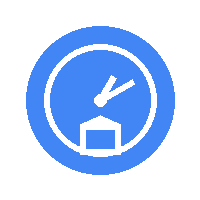

# Chrono Lite

<div align="center">



[](https://opensource.org/licenses/MIT)
[](https://github.com/google/clasp)
[](https://script.google.com)
[](./data/verified.json)

[English](./README.md) | [简体中文](./README.zh-CN.md)

**Open-source Gmail automation tool for smart email categorization**

*Auto-categorize newsletters and marketing emails • Privacy-first • No server needed*

<!-- TODO: Add hero GIF/screenshot -->
<!--  -->

</div>

---

## ✨ Features

- 🤖 **Smart Categorization** - Automatically detect and categorize newsletters based on 5,000+ verified sender database
- 🏷️ **Auto Labeling** - Organize emails with Gmail labels (Marketing/Newsletter/Product Updates) automatically
- 🗑️ **Bulk Cleanup** - Process 6 months of historical emails with one click
- 🔒 **Privacy First** - Everything runs in your Gmail account, zero data upload to external servers
- ⚡ **Fully Automated** - Set and forget with time-based triggers (runs every hour in background)
- 🎨 **Gmail Sidebar** - Beautiful interface built with Google Cards framework
- 🌐 **Open Source** - MIT licensed, community-driven sender database

---

## 🚀 Quick Start

### For Users (5 minutes)

#### Manual Installation ⭐ *Available now*

📺 **Video Tutorial**:
- 🚧 *Coming soon - Video tutorials are work in progress*

<details>
<summary>📖 Step-by-step Installation Guide</summary>

1. **Open Google Apps Script Console**
   - Visit https://script.google.com
   - Click "New Project" button
   - Give it a name like "Chrono Lite"

   <!-- TODO: Add screenshot -->

2. **Copy the Source Code**
   - Download or clone this repository
   - Open each file in `src/` folder:
     - `Code.gs`
     - `Config.gs`
     - `Database.gs`
     - `Classifier.gs`
     - `Actions.gs`
     - `UI.gs`
   - Create corresponding `.gs` files in Apps Script editor
   - Copy-paste the code

   <!-- TODO: Add screenshot -->

3. **Configure the Manifest**
   - In Apps Script editor, click "Project Settings" (⚙️)
   - Check "Show 'appsscript.json' manifest file"
   - Replace `appsscript.json` content with the one from this repo

   <!-- TODO: Add screenshot -->

4. **Authorize and Test**
   - Save all files (Ctrl/Cmd + S)
   - Select `initialSetup` function from dropdown
   - Click "Run" button
   - Follow the authorization prompts
   - Grant permissions to access your Gmail

   <!-- TODO: Add screenshot -->

5. **Open Gmail**
   - Refresh your Gmail tab
   - Look for Chrono Lite icon in the right sidebar
   - Click to open the add-on

   <!-- TODO: Add screenshot -->

✅ **Done!** New emails will be auto-categorized every hour.

</details>

<details>
<summary>🔧 Troubleshooting</summary>

**Can't see the sidebar icon?**
- Make sure you've configured `appsscript.json` correctly
- Try logging out and back into Gmail
- Check if authorization completed successfully

**No categories applied to emails?**
- Run `testDatabaseConnection()` function first to verify database loading
- Run `initialSetup()` to process recent emails
- Check Apps Script logs: View → Logs

**Getting timeout errors?**
- This is normal for large inboxes (>1000 emails)
- The script will auto-resume on next trigger
- Reduce batch size in `Config.gs` if needed

For more help, see [FAQ](./docs/faq.md) or [open an issue](https://github.com/msylctt/chrono-lite/issues).

</details>

---

### For Developers

Want to customize or contribute? Use `clasp` for local development:

```bash
# 1. Install clasp (Command Line Apps Script Projects)
npm install -g @google/clasp
clasp login

# 2. Clone this repository
git clone https://github.com/msylctt/chrono-lite.git
cd chrono-lite

# 3. Create a new Apps Script project
clasp create --type standalone --title "Chrono Lite"

# 4. Push code to Apps Script
clasp push

# 5. Open in editor
clasp open

# 6. Watch for changes (auto-push on save)
clasp push --watch
```

📚 **Full development guide**: [CLAUDE.md](./CLAUDE.md)

---

## 📖 Documentation

| Document | Description |
|----------|-------------|
| [Installation Guide](./docs/installation.md) | Detailed setup instructions with screenshots |
| [User Guide](./docs/user-guide.md) | How to use and customize Chrono Lite |
| [FAQ](./docs/faq.md) | Frequently asked questions |
| [Privacy Policy](./docs/privacy.md) | How we handle your data (spoiler: we don't) |
| [Development Guide](./CLAUDE.md) | For developers - architecture, best practices |
| [Complete Design Doc](./docs/Chrono-Lite-Complete-Design.md) | Full product design (12,000+ lines) |

---

## 🎥 Demo

### Email Categorization in Action

<!-- TODO: Add demo GIF -->
<!--  -->

**Before**: Cluttered inbox with newsletters mixed with important emails

**After**: Clean inbox with auto-categorized newsletters in dedicated labels

### Gmail Sidebar Interface

<!-- TODO: Add sidebar screenshot -->
<!--  -->

---

## 🏗️ How It Works

<details>
<summary>Click to expand architecture overview</summary>

```
┌─────────────────────────────────────────────────────────┐
│                  Chrono Lite Architecture                │
└─────────────────────────────────────────────────────────┘

1. 📥 Load Sender Database
   └─> Fetch from jsDelivr CDN (5,000+ verified senders)
   └─> Store in CacheService (50 shards, 6-hour expiry)
   └─> Fallback to embedded data if CDN fails

2. 🔍 Classify Emails (Three-tier matching)
   ├─ Tier 1: Exact email match (email@domain.com) [85% hit rate]
   ├─ Tier 2: Domain match (@domain.com) [10% hit rate]
   └─ Tier 3: Heuristic rules (List-Unsubscribe header) [5% hit rate]

3. 🏷️ Apply Actions
   ├─ Add Gmail label (e.g., "Newsletter/Marketing")
   ├─ Mark as read (optional)
   ├─ Archive (optional)
   └─ Star important ones (optional)

4. ⚡ Automation
   └─ Time-based trigger runs every hour
   └─ Processes last 100 emails
   └─ Respects Gmail API quotas
```

**Tech Stack**:
- **Platform**: Google Apps Script (JavaScript ES5, V8 Runtime)
- **Data Source**: jsDelivr CDN + GitHub
- **Storage**: CacheService (sharded), PropertiesService (config)
- **UI**: Gmail Cards Framework
- **Triggers**: Time-driven + Contextual

**Why sharded cache?**
CacheService has a 1,000-entry limit per cache. We use hash-based sharding (50 shards × ~100 entries) to support 5,000+ senders efficiently.

</details>

---

## 🤝 Contributing

We ❤️ contributions! Here's how you can help:

### 📬 Add Newsletter Senders

The sender database is the heart of Chrono Lite. Help us expand it!

👉 **Submit new senders**: [chrono-lite-newsletter-senders](https://github.com/msylctt/chrono-lite-newsletter-senders/issues/new)

Example submission:
```json
{
  "email": "newsletter@example.com",
  "category": "newsletter",
  "name": "Example Newsletter",
  "verified": true
}
```

### 🐛 Report Bugs / 💡 Request Features

- Found a bug? [Open an issue](https://github.com/msylctt/chrono-lite/issues/new?template=bug_report.md)
- Have a feature idea? [Start a discussion](https://github.com/msylctt/chrono-lite/discussions)

### 💻 Contribute Code

See [CONTRIBUTING.md](./CONTRIBUTING.md) for:
- Code style guidelines
- Development workflow
- How to submit pull requests

### 🌍 Translate Documentation

Help us support more languages! Current languages:
- [x] English
- [x] 简体中文 (Simplified Chinese)
- [ ] Español (Spanish) - Help wanted!
- [ ] Français (French) - Help wanted!
- [ ] 日本語 (Japanese) - Help wanted!

---


## ⚠️ Privacy & Security

### We take your privacy seriously

- ✅ **100% Open Source** - All code is public and auditable on GitHub
- ✅ **Zero Data Upload** - Everything runs locally in your Gmail account via Apps Script
- ✅ **No Tracking** - We don't collect any usage data or analytics
- ✅ **Minimal Permissions** - Only requests Gmail read/modify access (no access to Drive, Calendar, etc.)
- ✅ **No External Servers** - No backend servers, databases, or third-party services

### Required Permissions

| Permission | Why We Need It |
|------------|----------------|
| `gmail.modify` | To read email headers and apply labels |
| `gmail.settings.basic` | To create filters (optional) |
| `gmail.addons.current.message.readonly` | To show contextual cards in sidebar |
| `script.external_request` | To fetch sender database from CDN |

**Note**: The sender database is fetched from jsDelivr CDN (a public, open-source CDN). Your email content is **never** sent anywhere.

Learn more: [Privacy Policy](./docs/privacy.md)

---


<div align="center">

**⚡ From open-source tool to SaaS - Growing with users**

*Chrono Lite - Make Gmail inbox zero easy*

[⭐ Star this repo](https://github.com/msylctt/chrono-lite) • [🍴 Fork](https://github.com/msylctt/chrono-lite/fork) • [📢 Share on Twitter](https://twitter.com/intent/tweet?text=Check%20out%20Chrono%20Lite%20-%20Open-source%20Gmail%20automation%20tool!&url=https://github.com/msylctt/chrono-lite)

Made with ❤️ by the open-source community

</div>
