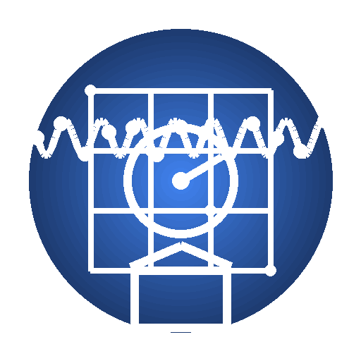

# Chrono Lite

<div align="center">

<!-- TODO: 添加 logo -->
<!--  -->

[](https://opensource.org/licenses/MIT)
[](https://github.com/google/clasp)
[](https://script.google.com)
[](./data/verified.json)

[English](./README.md) | [简体中文](./README.zh-CN.md)

**开源的 Gmail 邮件自动分类工具**

*自动识别 Newsletter 和营销邮件 • 隐私优先 • 无需服务器*

<!-- TODO: 添加演示 GIF/截图 -->
<!--  -->

</div>

---

## ✨ 核心功能

- 🤖 **智能分类** - 基于 5000+ 开源发件人数据库，自动识别和分类 Newsletter
- 🏷️ **自动标签** - 使用 Gmail 标签（营销邮件/Newsletter/产品更新）自动归类
- 🗑️ **批量清理** - 一键处理 6 个月的历史邮件
- 🔒 **隐私优先** - 所有处理都在你的 Gmail 账户中完成，零数据上传到外部服务器
- ⚡ **全自动化** - 设置后即可忘记，每小时自动后台运行
- 🎨 **Gmail 侧边栏** - 使用 Google Cards 框架构建的精美界面
- 🌐 **开源** - MIT 许可证，社区驱动的发件人数据库

---

## 🚀 快速开始

### 普通用户（5 分钟）

#### 方案 A：从 Google Workspace Marketplace 安装

🚧 *即将推出 - 目前正在 Google 审核中*

#### 方案 B：手动安装 ⭐ *现已可用*

📺 **视频教程**:
- [YouTube (English)](https://www.youtube.com) <!-- TODO: 添加实际视频链接 -->
- [Bilibili (中文)](https://www.bilibili.com) <!-- TODO: 添加实际视频链接 -->

<details>
<summary>📖 分步安装指南</summary>

1. **打开 Google Apps Script 控制台**
   - 访问 https://script.google.com
   - 点击"新建项目"按钮
   - 给项目命名，例如"Chrono Lite"

   <!-- TODO: 添加截图 -->

2. **复制源代码**
   - 下载或克隆本仓库
   - 打开 `src/` 文件夹中的每个文件:
     - `Code.gs`
     - `Config.gs`
     - `Database.gs`
     - `Classifier.gs`
     - `Actions.gs`
     - `UI.gs`
   - 在 Apps Script 编辑器中创建对应的 `.gs` 文件
   - 复制粘贴代码

   <!-- TODO: 添加截图 -->

3. **配置 Manifest**
   - 在 Apps Script 编辑器中，点击"项目设置"(⚙️)
   - 勾选"显示 'appsscript.json' 清单文件"
   - 用本仓库中的 `appsscript.json` 内容替换

   <!-- TODO: 添加截图 -->

4. **授权和测试**
   - 保存所有文件（Ctrl/Cmd + S）
   - 从下拉菜单中选择 `initialSetup` 函数
   - 点击"运行"按钮
   - 按照提示完成授权
   - 授予访问 Gmail 的权限

   <!-- TODO: 添加截图 -->

5. **打开 Gmail**
   - 刷新你的 Gmail 标签页
   - 在右侧边栏查找 Chrono Lite 图标
   - 点击打开插件

   <!-- TODO: 添加截图 -->

✅ **完成！** 新邮件将每小时自动分类一次。

</details>

<details>
<summary>🔧 故障排查</summary>

**看不到侧边栏图标？**
- 确保 `appsscript.json` 配置正确
- 尝试退出并重新登录 Gmail
- 检查授权是否成功完成

**邮件没有被分类？**
- 先运行 `testDatabaseConnection()` 函数验证数据库加载
- 运行 `initialSetup()` 处理近期邮件
- 查看 Apps Script 日志：视图 → 日志

**遇到超时错误？**
- 这对于大收件箱（>1000 封邮件）是正常的
- 脚本会在下次触发时自动恢复
- 如需要可在 `Config.gs` 中减小批处理大小

更多帮助，参见 [FAQ](./docs/faq.md) 或 [提交问题](https://github.com/msylctt/chrono-lite/issues)。

</details>

---

### 开发者

想要自定义或贡献代码？使用 `clasp` 进行本地开发：

```bash
# 1. 安装 clasp（Command Line Apps Script Projects）
npm install -g @google/clasp
clasp login

# 2. 克隆本仓库
git clone https://github.com/msylctt/chrono-lite.git
cd chrono-lite

# 3. 创建新的 Apps Script 项目
clasp create --type standalone --title "Chrono Lite"

# 4. 推送代码到 Apps Script
clasp push

# 5. 在编辑器中打开
clasp open

# 6. 监听变化（保存时自动推送）
clasp push --watch
```

📚 **完整开发指南**: [CLAUDE.md](./CLAUDE.md)

---

## 📖 文档

| 文档 | 描述 |
|----------|-------------|
| [安装指南](./docs/installation.md) | 详细的设置说明（带截图） |
| [用户指南](./docs/user-guide.md) | 如何使用和自定义 Chrono Lite |
| [常见问题](./docs/faq.md) | 常见问题解答 |
| [隐私政策](./docs/privacy.md) | 我们如何处理你的数据（剧透：我们不处理） |
| [开发指南](./CLAUDE.md) | 面向开发者 - 架构、最佳实践 |
| [完整设计文档](./docs/Chrono-Lite-Complete-Design.md) | 完整产品设计（12,000+ 行） |

---

## 🎥 演示

### 邮件分类实际效果

<!-- TODO: 添加演示 GIF -->
<!--  -->

**之前**: 收件箱混乱，Newsletter 和重要邮件混在一起

**之后**: 收件箱清爽，Newsletter 自动归类到专用标签

### Gmail 侧边栏界面

<!-- TODO: 添加侧边栏截图 -->
<!--  -->

---

## 🏗️ 工作原理

<details>
<summary>点击展开架构概览</summary>

```
┌─────────────────────────────────────────────────────────┐
│                    Chrono Lite 架构                      │
└─────────────────────────────────────────────────────────┘

1. 📥 加载发件人数据库
   └─> 从 jsDelivr CDN 获取（5000+ 已验证发件人）
   └─> 存储在 CacheService（50 个分片，6 小时过期）
   └─> CDN 失败时回退到内嵌数据

2. 🔍 分类邮件（三级匹配）
   ├─ 第一级：精确邮箱匹配（email@domain.com）[85% 命中率]
   ├─ 第二级：域名匹配（@domain.com）[10% 命中率]
   └─ 第三级：启发式规则（List-Unsubscribe 头）[5% 命中率]

3. 🏷️ 应用操作
   ├─ 添加 Gmail 标签（如"Newsletter/营销"）
   ├─ 标记为已读（可选）
   ├─ 归档（可选）
   └─ 加星标重要邮件（可选）

4. ⚡ 自动化
   └─ 基于时间的触发器每小时运行
   └─> 处理最近 100 封邮件
   └─> 遵守 Gmail API 配额
```

**技术栈**:
- **平台**: Google Apps Script (JavaScript ES5, V8 Runtime)
- **数据源**: jsDelivr CDN + GitHub
- **存储**: CacheService（分片）、PropertiesService（配置）
- **UI**: Gmail Cards Framework
- **触发器**: 时间驱动 + 上下文触发

**为什么使用分片缓存？**
CacheService 每个缓存有 1000 条目的限制。我们使用基于哈希的分片（50 个分片 × ~100 条目）来高效支持 5000+ 发件人。

</details>

---

## 🤝 贡献

我们 ❤️ 欢迎贡献！以下是你可以帮助的方式：

### 📬 添加 Newsletter 发件人

发件人数据库是 Chrono Lite 的核心。帮助我们扩展它！

👉 **提交新发件人**: [chrono-lite-newsletter-senders](https://github.com/msylctt/chrono-lite-newsletter-senders/issues/new)

提交示例:
```json
{
  "email": "newsletter@example.com",
  "category": "newsletter",
  "name": "示例 Newsletter",
  "verified": true
}
```

### 🐛 报告 Bug / 💡 功能建议

- 发现 Bug？[提交问题](https://github.com/msylctt/chrono-lite/issues/new?template=bug_report.md)
- 有功能想法？[发起讨论](https://github.com/msylctt/chrono-lite/discussions)

### 💻 贡献代码

查看 [CONTRIBUTING.md](./CONTRIBUTING.md) 了解：
- 代码风格指南
- 开发工作流
- 如何提交 Pull Request

### 🌍 翻译文档

帮助我们支持更多语言！当前支持的语言：
- [x] English（英文）
- [x] 简体中文
- [ ] Español（西班牙语）- 需要帮助！
- [ ] Français（法语）- 需要帮助！
- [ ] 日本語（日语）- 需要帮助！

---

## 📊 路线图

- [x] **阶段 1**: 核心数据层和 CDN 集成
- [x] **阶段 2**: 分类引擎（三级匹配）
- [x] **阶段 3**: Gmail 侧边栏 UI 和引导流程
- [ ] **阶段 4**: Google Workspace Marketplace 上架
- [ ] **阶段 5**: 扩展发件人数据库至 10,000+
- [ ] **阶段 6**: 社区贡献平台
- [ ] **阶段 7**: AI 驱动的发件人检测（可选）

查看 [Projects](https://github.com/msylctt/chrono-lite/projects) 了解详细进度。

---

## ⚠️ 隐私与安全

### 我们非常重视你的隐私

- ✅ **100% 开源** - 所有代码在 GitHub 上公开并可审计
- ✅ **零数据上传** - 所有处理通过 Apps Script 在你的 Gmail 账户中本地完成
- ✅ **无跟踪** - 我们不收集任何使用数据或分析
- ✅ **最小权限** - 仅请求 Gmail 读写权限（无 Drive、Calendar 等访问权限）
- ✅ **无外部服务器** - 没有后端服务器、数据库或第三方服务

### 所需权限

| 权限 | 用途 |
|------------|----------------|
| `gmail.modify` | 读取邮件头并应用标签 |
| `gmail.settings.basic` | 创建过滤器（可选） |
| `gmail.addons.current.message.readonly` | 在侧边栏中显示上下文卡片 |
| `script.external_request` | 从 CDN 获取发件人数据库 |

**注意**: 发件人数据库从 jsDelivr CDN（一个公共的开源 CDN）获取。你的邮件内容**永远不会**被发送到任何地方。

了解更多: [隐私政策](./docs/privacy.md)

---

## 📝 许可证

MIT License - 查看 [LICENSE](./LICENSE)

这意味着你可以:
- ✅ 商业使用
- ✅ 修改
- ✅ 分发
- ✅ 再许可
- ✅ 私人使用

感谢署名但不强制要求！

---

## 💬 获取帮助

- 📚 **文档**: [docs/](./docs/)
- 💡 **FAQ**: [docs/faq.md](./docs/faq.md)
- 🐛 **问题**: [github.com/msylctt/chrono-lite/issues](https://github.com/msylctt/chrono-lite/issues)
- 💬 **讨论**: [github.com/msylctt/chrono-lite/discussions](https://github.com/msylctt/chrono-lite/discussions)
- 📧 **邮箱**: [chrono.lite@example.com](mailto:chrono.lite@example.com) <!-- TODO: 更新邮箱 -->

---

## 🙏 致谢

- 感谢所有帮助扩展发件人数据库的[贡献者](https://github.com/msylctt/chrono-lite/graphs/contributors)
- 使用 [Google Apps Script](https://developers.google.com/apps-script) 用 ❤️ 构建
- 由 [jsDelivr CDN](https://www.jsdelivr.com/) 提供快速可靠的数据传输
- 受到对**隐私优先** Gmail 自动化工具需求的启发
- 特别感谢 [Claude Code](https://claude.ai/code) 在产品设计和开发中的协助

---

<div align="center">

**⚡ 从开源工具到 SaaS - 与用户一起成长**

*Chrono Lite - 让 Gmail 收件箱清零变得简单*

[⭐ Star 本仓库](https://github.com/msylctt/chrono-lite) • [🍴 Fork](https://github.com/msylctt/chrono-lite/fork) • [📢 分享到微博](https://service.weibo.com/share/share.php?url=https://github.com/msylctt/chrono-lite&title=推荐一个开源的%20Gmail%20自动化工具%20Chrono%20Lite!)

由开源社区用 ❤️ 制作

</div>
